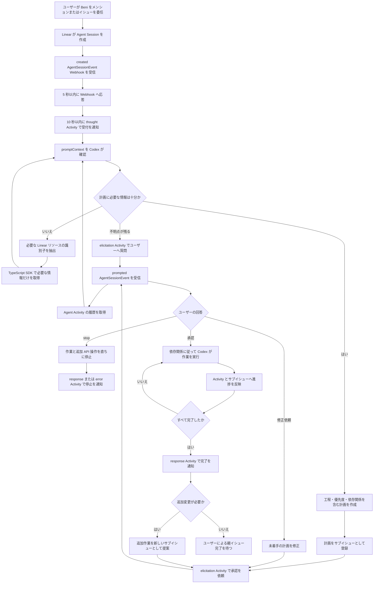

# Beni のアプリケーション動作フロー

## 目的

Beni は常駐するデスクトップアプリケーションとして Linear の Agent Session を受け取り、ローカルプロジェクトに対する作業を Codex へ依頼します。本書では、Linear Agent API の操作モデルに沿って、依頼の受付、必要な情報の取得、計画の提案、ユーザーの承認、作業の実行、完了通知までの流れを整理します。

Linear の Agent API は Developer Preview であり、一般提供までに変更される可能性があります。実装時は最新の公式ドキュメントと SDK の型定義を確認します。

## 基本方針

- Beni は OAuth の `actor=app` でインストールされる Linear Agent として動作する。
- 起点には、Beni へのメンションまたはイシューの委任によって作られる Agent Session を使用する。
- Linear の全イベントを受信・保存せず、Beni に直接関係する `AgentSessionEvent` だけを受信する。
- 初期コンテキストには Webhook の `promptContext` を使用する。
- 追加情報は、Codex が必要なリソースの識別子を選んだ後で、原則として TypeScript SDK（`@linear/sdk`）から取得する。
- Linear 上の会話履歴は Agent Activity から復元し、ローカルに全イベントのコピーを作らない。
- 作業開始前に計画を提示し、ユーザーから明示的な承認を得る。
- Beni の状態と進捗は Agent Activity を通じて Linear 上へ返す。
- 最終的な責任と親イシューを完了する判断はユーザーが持つ。

## 全体フロー

## 1. Linear Agent のセットアップ

Beni は通常のユーザーになり代わる統合ではなく、Linear 上で独立した Agent として表示します。

1. Linear OAuth アプリケーションを作成し、インストール URL に `actor=app` を指定する。
2. Beni をイシューへ委任できるようにする場合は `app:assignable`、メンションできるようにする場合は `app:mentionable` スコープを要求する。
3. OAuth アプリケーション設定で **Agent session events** の Webhook カテゴリを有効にする。
4. ワークスペースごとに異なる Beni の app user ID をアクセストークンと対応付け、安全な資格情報ストアへ保存する。
5. 必要なチームとリソースだけにアクセスできるスコープを要求する。

イシューをBeniへ割り当てる操作は、人間の assignee を置き換えるのではなく、Beni を delegate に設定します。これにより、人間が所有権と最終責任を持ったままAgentへ作業を委任できます。

## 2. Agent Session Webhook の受信

Beni がメンションされるかイシューを委任されると、Linear が Agent Session を自動的に作成します。Beni はこのSessionに関する `AgentSessionEvent` のみを処理します。

### `created`

新しいAgent Sessionが作成されたことを表します。ペイロードには対象の `agentSession` と、関連するイシュー、コメント、親イシュー、プロジェクト、Guidanceなどを整形した `promptContext` が含まれます。Beniはこれを新しいCodexループの起点にします。

### `prompted`

ユーザーが既存のAgent Sessionへ追加メッセージを送ったことを表します。新しいメッセージはWebhookの `agentActivity.body` から取得し、既存の会話へ追加します。計画の修正、承認、質問への回答、追加作業の依頼もこのイベントとして扱います。

### 受信時の制約

1. Webhook署名を検証し、不正なリクエストは処理しない。
2. Webhook receiverは5秒以内に応答する。
3. `created`を受け取った場合は、Agentが応答不能と表示されないよう10秒以内に `thought` Activityを送る。
4. Webhook IDとAgent Session IDで重複実行を防ぐ。
5. 時間のかかるCodex処理はWebhookへの応答後に行う。

`AgentSessionEvent` はBeni固有のAgentへ直接関係するイベントだけが配信されます。そのため、通常のイシュー更新、コメント、ラベル変更などを網羅的に購読したり、そのペイロードをすべてSQLiteへ保存したりしません。

## 3. Agent Activity による対話と状態表示

Beni はコメントを直接的な進捗ログとして使うのではなく、Agent Sessionに次のAgent Activityを送信します。

| Activity | 用途 |
| --- | --- |
| `thought` | 依頼を受け付けたことや、現在確認している内容を短く伝える |
| `elicitation` | 不足情報、計画の確認、承認をユーザーへ求める |
| `action` | 情報取得、リポジトリ操作、テストなどの開始と結果を示す |
| `response` | 作業の完了、停止、または最終結果を伝える |
| `error` | 続行できない失敗と、ユーザーが取れる対応を伝える |

最後に送られたActivityに基づき、LinearがAgent Sessionを `pending`、`active`、`awaitingInput`、`complete`、`error`、`stale` のいずれかへ自動的に遷移させます。BeniはSession状態を独自に推測して手動更新しません。

ActivityはユーザーがAgentの状態をLinear上で確認できる粒度にします。ただし、シークレット、アクセストークン、不要な個人情報、秘匿すべきプロンプト、長大な内部推論はActivityやログへ出力しません。

## 4. 必要な情報の選択と取得

最初のCodex呼び出しでは実作業を行いません。まず `promptContext` を確認し、作業計画を作るために十分な情報があるかを判定します。

Codexの判定結果には次を含めます。

- 判定: 情報が十分、Linearから追加取得が必要、またはユーザーへの質問が必要
- 追加取得が必要な場合: イシュー、コメント、親子イシュー、プロジェクトなどの種別と識別子
- 質問が必要な場合: 推測では決定できない不足事項

追加情報が必要な場合は、指定された識別子に対応するリソースだけを `@linear/sdk` から取得し、コンテキストへ加えて再判定します。すべてのLinearイベントを事前収集することや、ワークスペース全体をローカルへ複製することはしません。

### APIクライアントの選択

Linearとのデータ取得および更新には、型が付いた `@linear/sdk` を原則として使用します。Agent SessionとActivityの取得、Agent Activityの送信、イシューやコメントの取得、サブイシューの作成と更新もSDKを通して行います。これにより、GraphQLのクエリ文字列、変数、レスポンス型を個別に管理する処理を減らします。

使用中のSDKでまだ提供されていないDeveloper Preview機能が必要な場合、または必要なフィールドをSDKで取得できない場合に限り、Linear GraphQL APIを直接使用します。GraphQLを使う場合も取得範囲を必要なフィールドに限定し、SDKと同じ認証情報およびエラー処理の方針に従います。

ユーザーへの質問が必要な場合は `elicitation` Activityを送り、Sessionを入力待ちにします。回答の `prompted` Webhookを受けたら、Agent Sessionに紐づくActivity一覧をAPIから取得して会話を復元します。通常のコメントは編集される可能性があるため、ユーザー入力の履歴には変更されないスナップショットであるAgent Activityを優先します。

## 5. ローカルで保持する最小限の状態

Linearを情報の正本とし、SQLiteには再起動からの復旧と重複実行防止に必要な情報だけを保存します。

- ワークスペースとBeniのapp user IDの対応
- Agent Session IDと対象イシューID
- 最後に処理したWebhook IDまたはActivity ID
- 現在実行中のCodex処理と、その再開に必要な状態
- ユーザーによる計画の承認状態
- Beniが作成したサブイシューの識別子
- ローカルプロジェクトとLinearリソースの必要最小限の対応

Webhookの全ペイロード、全コメント、全イシュー更新は保存しません。再び必要になったLinear上の情報は識別子を使ってAPIから取得します。OAuthトークンやWebhookシークレットはSQLiteやソースコードへ保存せず、OSの安全な資格情報ストアなどから読み込みます。

## 6. 作業計画とサブイシューの作成

情報が十分になったら、Codexは作業を実行可能な単位へ分解します。各工程には次を含めます。

- 具体的な目的と完了条件
- 優先度
- 計画段階のステータス（原則としてBacklog）
- 他の工程にブロックされるかどうか
- 他の工程と並列実行できるかどうか

工程ごとに親イシュー配下のサブイシューを `@linear/sdk` で作成します。作成者がBeniであり、計画段階のBacklogにあるサブイシューだけを、計画修正の対象にできます。すでに実行を開始したものや完了したサブイシューは、計画を直す目的で書き換えません。

サブイシューを作成した後、`elicitation` Activityで提案内容を示し、ユーザーへ承認または修正を求めます。この時点ではリポジトリを変更しません。選択肢を提示する場合は `select` signalを利用できますが、自由文の回答もCodexで解釈します。

Agent Plan APIはSession内の進捗表示に利用できますが、Technology Previewであり仕様変更の可能性があります。永続的な作業管理にはサブイシューを使用し、Agent Planを必須の保存先にはしません。

## 7. 計画の確認と修正

`prompted`イベントで受け取ったユーザーの回答をCodexが解釈します。

- **承認**: 計画を確定し、実行段階へ進む。
- **修正指示**: 指示に従い、Beniが作成した未着手のBacklogサブイシューだけを更新する。
- **追加情報**: コンテキストへ加え、必要であれば関連リソースをAPIから取得する。
- **不明確な回答**: `elicitation` Activityで確認し、承認されたものと推測しない。

修正後は再び `elicitation` Activityで計画を提示します。明確な承認をAgent Activityとして受け取るまでは、Codexに実作業を行わせません。

## 8. 承認後のタスク実行

承認後は、計画に記録した依存関係に従ってサブイシューを処理します。

1. 未完了で、ブロックされていないサブイシューを選ぶ。
2. `action` Activityで開始する操作をユーザーへ示す。
3. 並列実行可能な工程は、同じファイルへの競合や前提条件がない範囲で並列に処理する。
4. 依存工程があるものは、ブロッカーが完了してから開始する。
5. 各工程で変更、検証、結果の記録を行う。
6. 成功したサブイシューを完了にし、後続工程のブロックを解除する。
7. 続行できない失敗は `error` Activityで通知し、根拠なく後続工程を進めない。

計画外の作業が必要になった場合は、既存の完了済みサブイシューを変更しません。新しいサブイシューとして提案し、改めてユーザーの承認を得ます。

## 9. 停止、完了、追加変更

ユーザーから `stop` signalを持つprompt Activityを受け取った場合、Beniはコード変更、Linear更新、その他のAPI呼び出しを直ちに停止します。安全に停止した後、`response`または`error` Activityで停止したことと現在の状態を知らせます。ユーザーから明確な再開指示を受けるまで処理を再開しません。

すべてのサブイシューが完了したら、Beniは `response` Activityで結果を通知します。親イシューを完了ステータスへ変更する最終判断はユーザーに委ねます。

完了後に追加変更が依頼された場合は、その変更をパッチ作業として新しいサブイシューにします。目的、優先度、依存関係を提示し、再びユーザーの承認を得てから実行します。これにより、完了した工程の履歴を保ったまま変更経緯を追跡できます。

## 状態遷移の要点

| Beniの処理段階 | Linear上の表現 | 次へ進む条件 |
| --- | --- | --- |
| Session受付 | `thought` Activity | `created`を受信して受付を通知 |
| 情報確認 | `thought`または`action` Activity | `promptContext`と必要なAPI取得結果を確認 |
| 情報待ち | `elicitation` Activity | `prompted`でユーザー回答を受信 |
| 計画確認 | `elicitation` Activity | ユーザーが計画を明示的に承認 |
| 実行中 | `action` Activity | 依存工程を順次完了 |
| 失敗 | `error` Activity | ユーザーの追加指示または再試行条件を受信 |
| 停止 | `response`または`error` Activity | ユーザーから明確な再開指示を受信 |
| 完了 | `response` Activity | ユーザーが親イシューを完了、または追加変更を依頼 |

## 公式ドキュメント

- [Agent Interaction Guidelines](https://linear.app/developers/aig)
- [Agents: Getting Started](https://linear.app/developers/agents)
- [Developing the Agent Interaction](https://linear.app/developers/agent-interaction)
- [Interaction Best Practices](https://linear.app/developers/agent-best-practices)
- [Signals](https://linear.app/developers/agent-signals)
